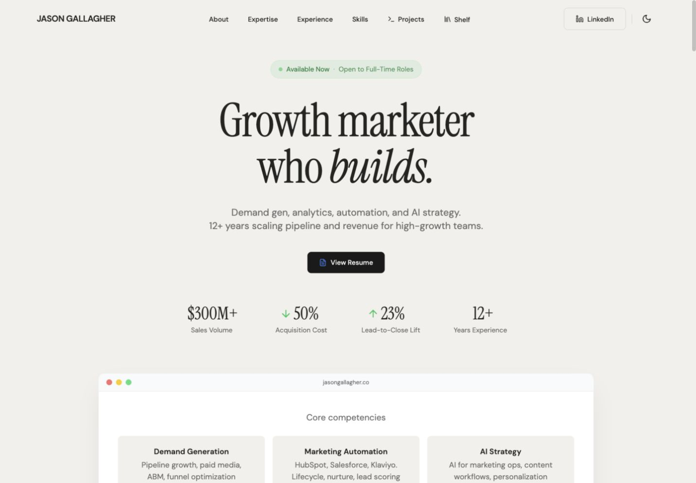
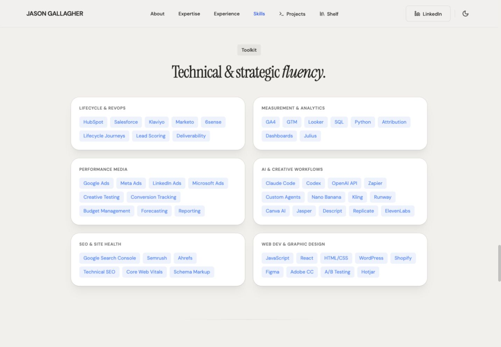
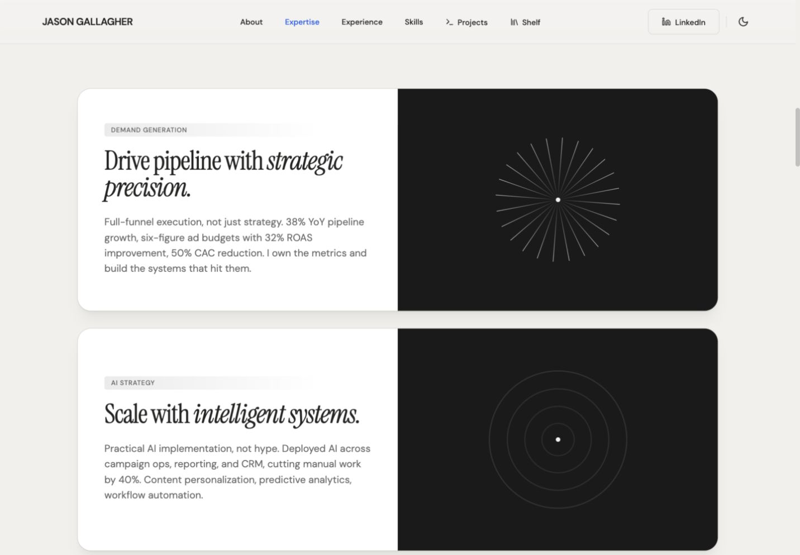
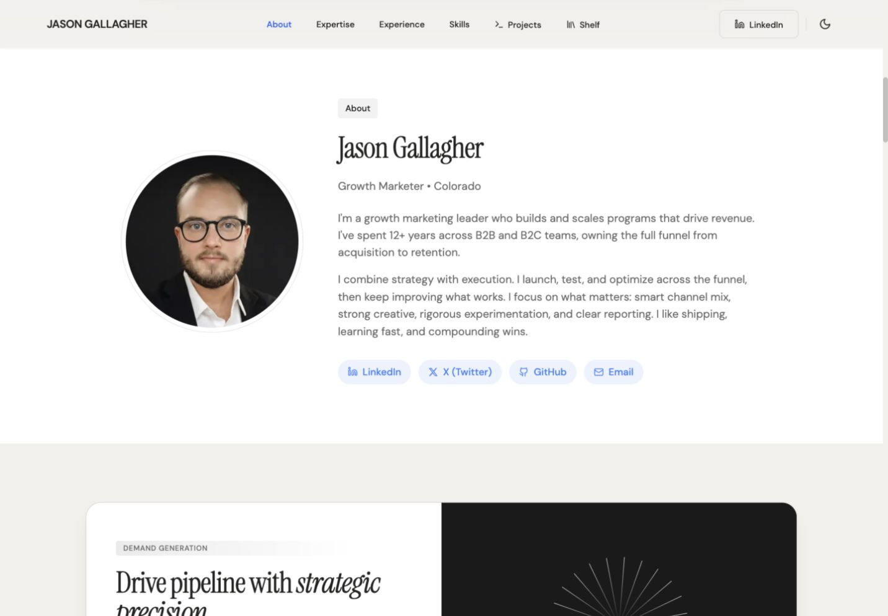
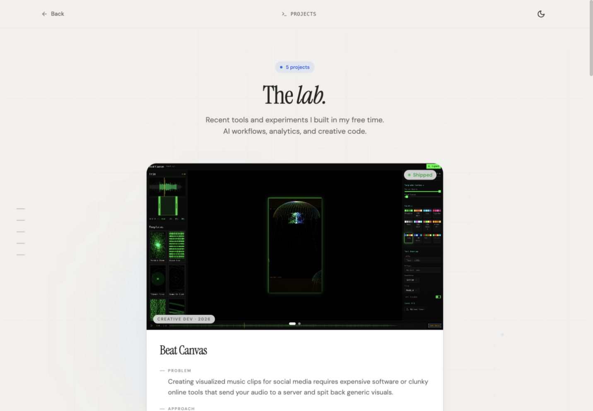
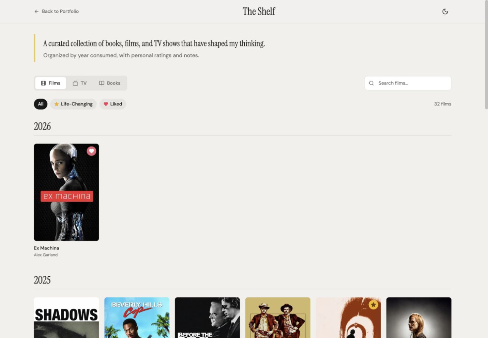
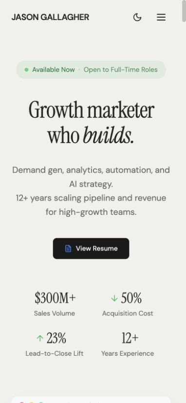
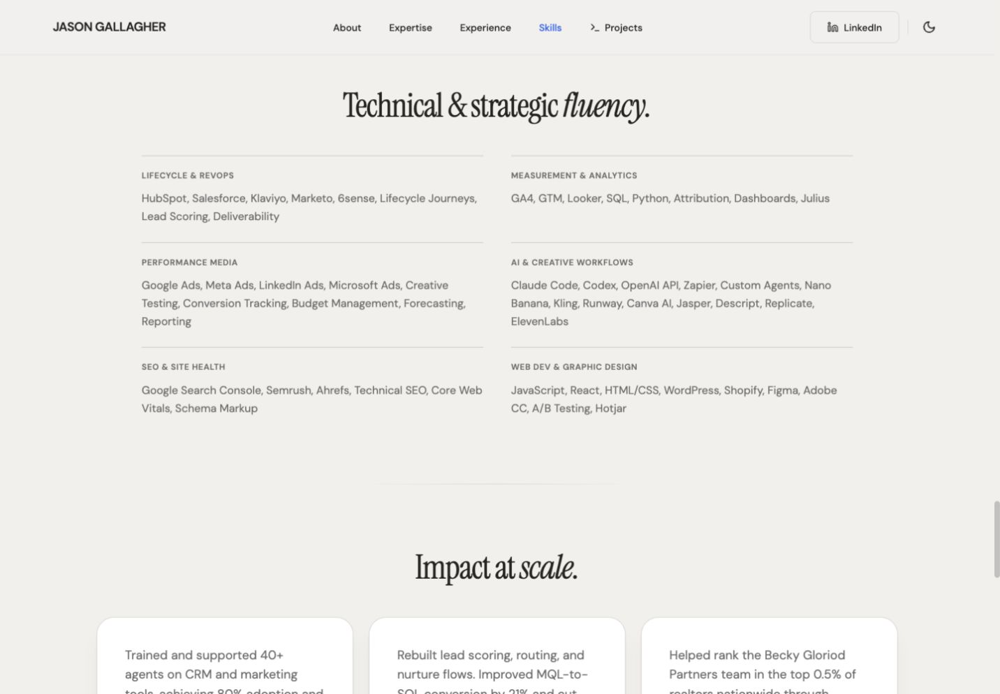
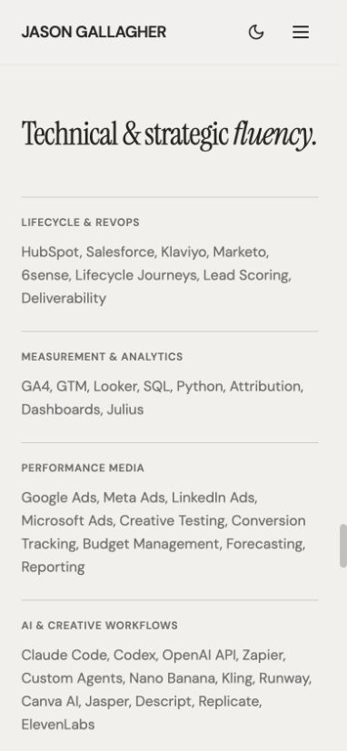
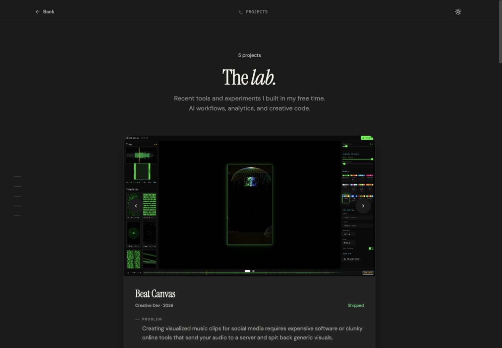

# Portfolio audit: the tell-tale patterns

October 1, 2026. Reviewed the existing local homepage, Projects, and Shelf, including the mobile hero. The screenshots below document the original design after the experimental overhaul was reverted. The selected refinements subsequently implemented are recorded at the end of this report.

The typography, warm background, portrait, real project screenshots, and specific career results are worth keeping. The strongest generic signals come from repeated UI packaging around that content.

## Highest-impact small changes

| Priority | Pattern actually present | Where | Smallest useful change |
| --- | --- | --- | --- |
| 1 | 53 blue skill chips nested inside six rounded, shadowed cards | Skills | Keep the categories and two-column layout. Render the tool names as plain text lists. Remove the hover lift from these informational cards. |
| 2 | Repeated eyebrow badges above already sufficient headings | “About,” “Projects,” “Career,” “Toolkit,” and “Results” | Delete those five badges. Keep the headings, content, and positioning. |
| 3 | A decorative browser window containing more rounded cards | Hero, “Core competencies” | Remove the traffic lights, fake URL bar, and outer shadow. Keep the six competencies and their existing arrangement. |
| 4 | Too much pill styling for ordinary text and links | Green availability message, four About social links, project count/status/category/technology labels | Keep the information. Make availability and project metadata plain text; simplify social links without changing their placement. |
| 5 | The same radius, shadow, outline, and lift treatment on unrelated content | Expertise, Skills, results, and project cards | Keep the layouts. Reduce outer radiuses and shadows on the most conspicuous containers, and remove lift effects from static content. |
| 6 | An extra heading layer that says less than the small label above it | Expertise: “Drive pipeline with strategic precision,” “Scale with intelligent systems,” “Build systems that compound” | Promote the existing competency names to headings and remove the slogans. Keep the metrics and descriptions. |
| 7 | Decorative effects competing with real project evidence | Projects: background grid, pulsing nodes, blue/cyan glow orbs, glowing card borders, frosted metadata badges | Remove the background effects and hover glow. Keep screenshots, carousel functionality, and Problem / Approach / Result. |

These are independent edits. None requires changing the font pairing, palette, overall section order, centered hero, portrait crop, or project image selection.

## Captured evidence

### 1. Hero — good typographic foundation, excessive packaging

The serif headline is strong. The green availability pill with its pulsing dot and the fake browser frame introduce familiar template styling. The six competencies are useful; the simulated browser controls do not communicate anything about them. The noninteractive competency tiles also use a pointer cursor.

### 2. Skills — the clearest tell

The “Toolkit” badge, large centered slogan, six rounded cards, and 53 blue chips combine several generic patterns in one section. This is the highest-return place for a small cleanup. Preserve the categories and content; change their presentation.

### 3. Expertise — too much presentation for three useful claims

Each card spends roughly half its space on an abstract animated graphic. Together with large radiuses, shadows, uppercase gradient labels, and slogan headings, the repetition feels templated. The numbers in the paragraphs are stronger than the slogans. A conservative option is to keep one geometric motif and stop its animation, rather than remove every graphic.

### 4. About — strong personal material, unnecessary badges

Keep the circular portrait and bio layout. Remove the “About” eyebrow and simplify the four matching blue social pills. The sentence about “shipping, learning fast, and compounding wins” sounds more generic than the concrete description of your work.

### 5. Projects — useful case-study structure under excessive effects

The real screenshots and Problem / Approach / Result structure work. The background grid, decorative nodes, glow orbs, rounded outer shells, image-overlay pills, and stack chips add template styling. The “5 projects” badge is another unnecessary pre-heading label. Keep “The lab.”; it has more personality than an interchangeable section slogan.

### 6. Shelf — the grid and filters serve the content

This is a lower-priority area. Covers benefit from a grid, and the All / Life-Changing / Liked controls actually filter content. Their pill styling has a purpose. The star and heart markers convey personal judgments, so they are more defensible than decorative icons elsewhere. The poster hover zoom and dark overlay could be removed without changing the page's design.

### 7. Mobile hero — readable, but the spacing magnifies the template rhythm

The headline remains legible and the metrics fit a deliberate two-column arrangement. Large gaps between the badge, heading, description, CTA, and metrics push the competency content below the first screen. Tighten those gaps before considering a different composition.

## Lower-priority observations

- **CTAs:** The hero has one CTA, which is restrained. Repeating the resume link at the bottom of a long page is reasonable. Button icons and the extra “Want to collab?” / “Let's let's build.” copy on Projects are easier cleanup targets than removing useful contact routes.
- **Headings:** “Impact at scale,” “Technical & strategic fluency,” and “Strategic, Technical, Creative & Results-Driven” are broad portfolio language. Shorten selected headings instead of renaming every section.
- **Navbar:** The homepage uses a full-width fixed navbar, not a floating pill-shaped SaaS navbar. Its blur, boxed LinkedIn link, and terminal/library icons can be simplified, but the navigation structure does not need replacement.
- **Cards:** A project preview or cover collection can reasonably use repeated units. The issue is the identical decoration across every type of content, not the existence of any card or grid.

## Accessibility notes and limits

The original faint blue chip text and small, low-opacity project metadata deserved contrast checks. Code inspection also found no reduced-motion handling for the looping graphics and scroll animations. Shelf covers are clickable divs without keyboard button semantics, and its detail overlay lacks dialog semantics and a focus trap. Motion handling and Shelf accessibility remain separate implementation issues.

This is a visual and code audit, not a complete accessibility certification, production performance test, or verification of the career/project outcome claims.

## Selected refinements implemented

The user selected priorities 1, 2, 4, and 7, plus removing Shelf from navigation.

- **Skills:** Preserved all 53 skills, six categories, and the two-column desktop layout. Replaced chips and shadowed cards with comma-separated text lists and thin category rules.
- **Eyebrows:** Removed the five redundant About / Projects / Career / Toolkit / Results badges.
- **Pills:** Removed the availability callout entirely on follow-up. Simplified About social links, project count, status, category, year, and technology lists. Social links retain recognizable icons, underlines, 44px height, and a visible keyboard focus outline.
- **Project effects:** Removed the background grid, pulsing nodes, glow orbs, hero parallax, card hover glow/lift, screenshot gradient overlay, and frosted metadata overlays. Metadata now sits below project titles; screenshot carousels and case-study content remain intact.
- **Shelf:** Removed desktop and mobile navbar links. The page, route, and content remain available directly at `/shelf`.

Preserved the font pairing, palette, section order, centered hero, portrait, competency browser composition, Expertise graphics, existing copy, and real project screenshots. Other card styling was kept outside the selected Skills cleanup.

Validation: production build and whitespace checks passed. Browser checks confirmed all skill content remains, desktop and mobile navigation omit Shelf, and `/shelf` still loads. Checked light/dark layouts, mobile wrapping without horizontal overflow, keyboard focus on social links, and carousel navigation. New light-mode text contrast ranges from 4.68:1 to 7.56:1; the checked dark-mode text exceeds 7:1. The untouched animation and Shelf accessibility issues above remain.

Remaining visual priorities: the decorative hero browser, repeated card shells outside Skills, and the animated Expertise graphics and slogan headings. These were deliberately left for a separate decision.
