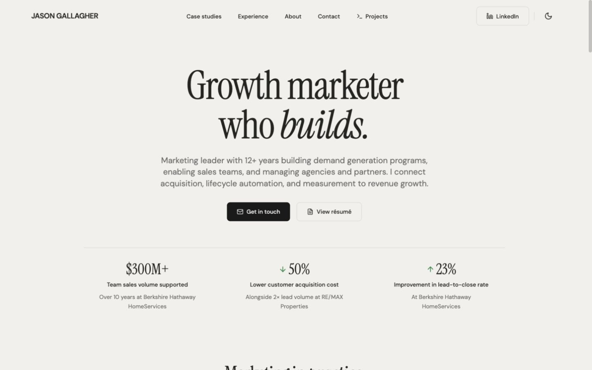
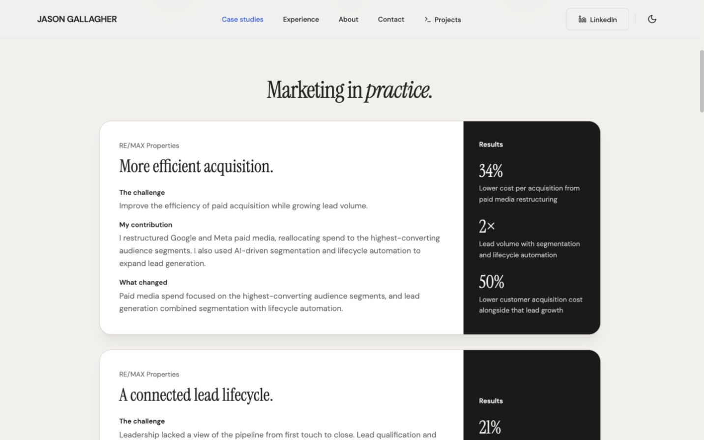
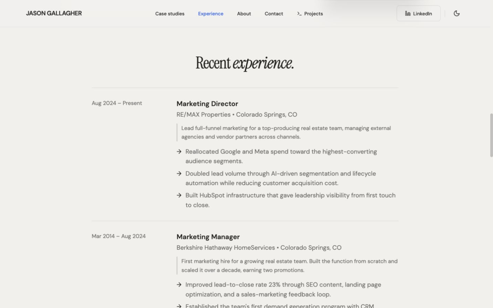
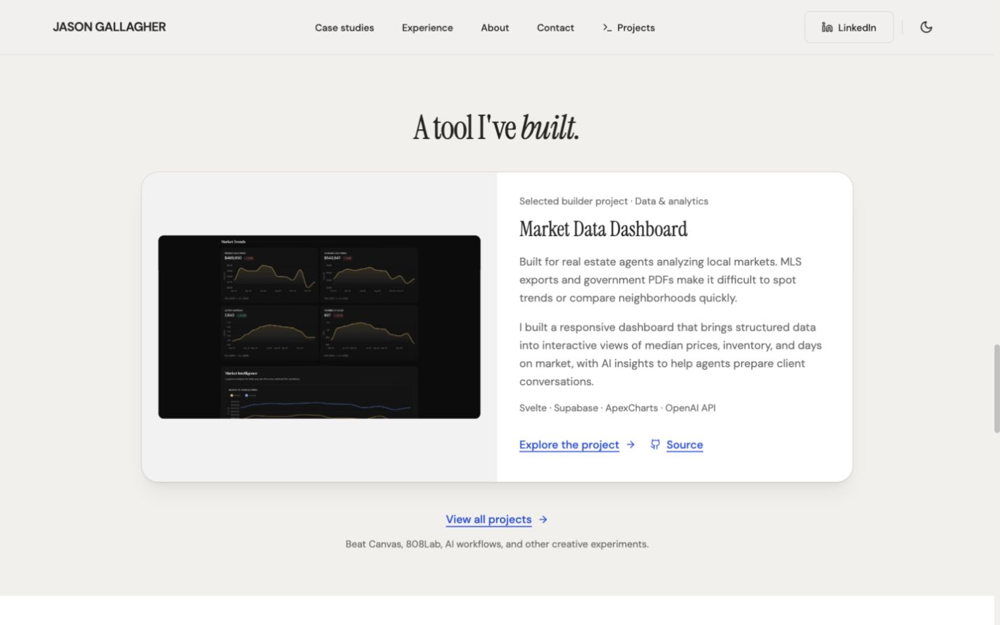
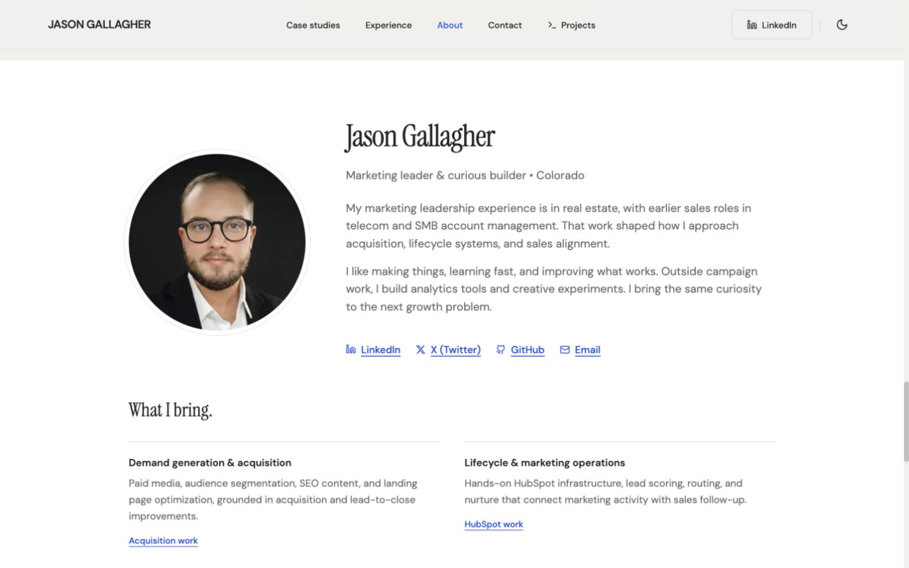
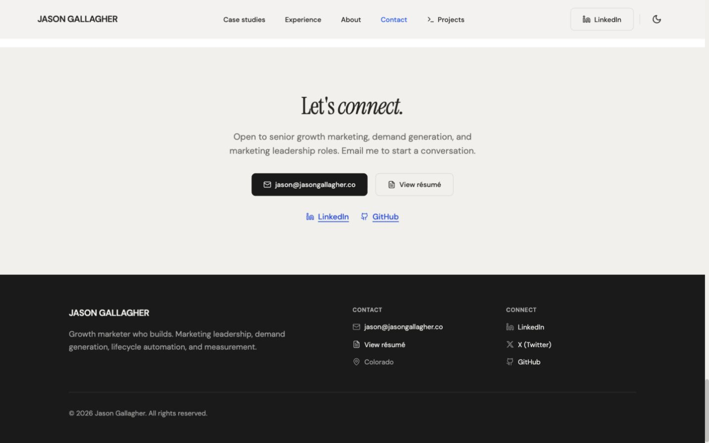
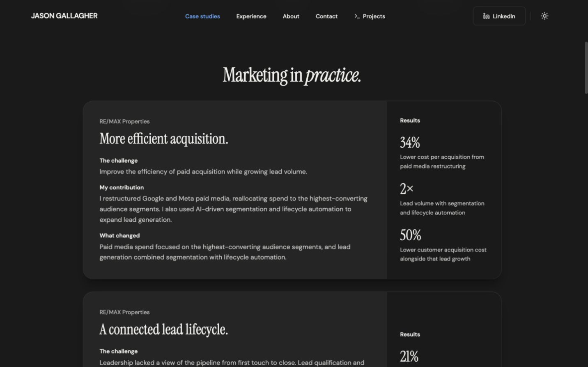
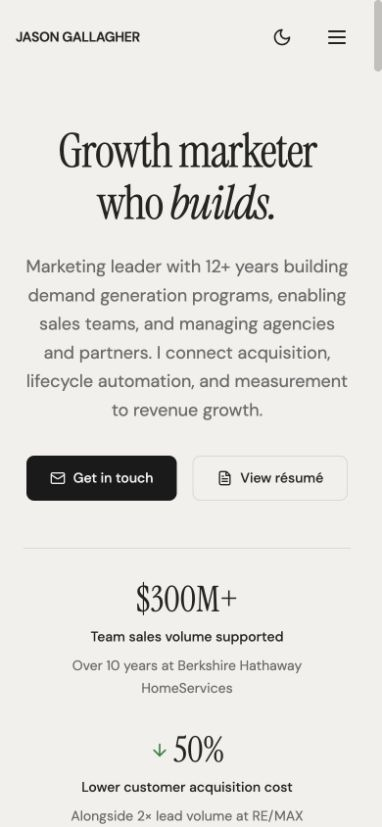
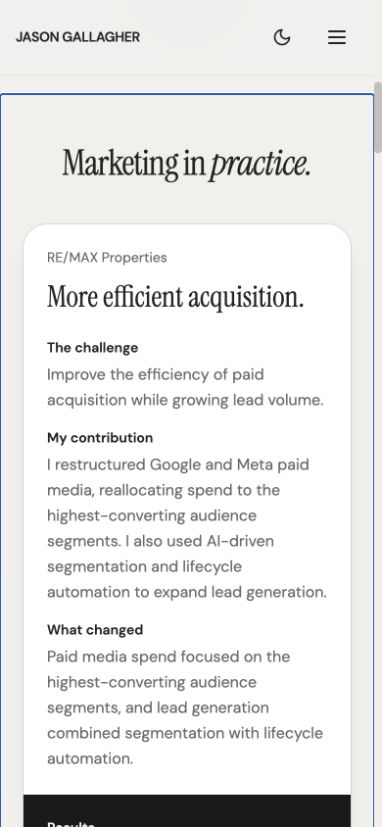
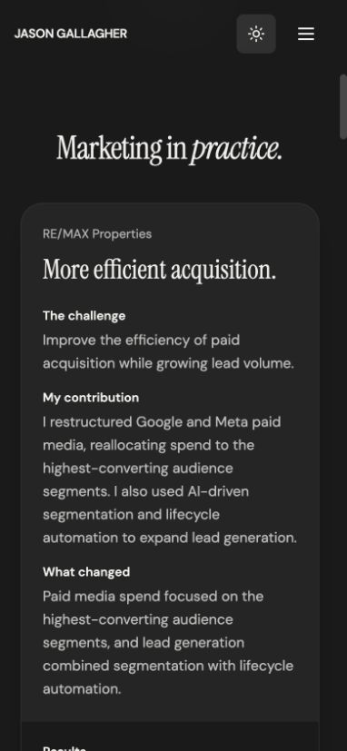

# Homepage refinement audit

Reviewed 1 October 2026 at http://127.0.0.1:5174/. This is a recommendation-only review of the current local homepage. No application code was changed or published during this audit.

The typography, warm neutral palette, portrait, real dashboard screenshot, experience timeline, and plain capability rows provide a useful foundation. The strongest opportunity is to reduce repeated packaging around the professional evidence. The current navbar is already a conventional full-width bar; it does not need a replacement floating navigation design.

## Five selectable improvements

1. **Turn the marketing cards into editorial case studies.** Highest impact; medium scope. Steps 2, 7, 9, and 10 show repeated 24px rounded panels, shadows, and separate oversized results panels. Use open rows with thin separators, employer metadata, a descriptive title, concise narrative, and integrated outcomes. Combine repetitive contribution/change wording while preserving the distinction between problem, action, change, and documented result. Keep employer context; it is useful evidence rather than a decorative eyebrow.
2. **Make the opening more compact and composed.** High impact; medium scope. Steps 1 and 8 show a large centered headline, centered supporting copy, two icon buttons, and a separate metrics block. Keep “Growth marketer who builds,” the font pairing, leadership positioning, and all three qualified results. Try left-aligned text with a restrained results column on desktop. Keep email prominent and the résumé beside it as a simpler text link. Reduce headline size and top padding rather than changing the brand.
3. **Design mobile around access to evidence.** High impact; medium scope, overlaps options 1 and 2. Steps 8–10 show vertically stacked hero metrics and a case-study narrative that precedes its entire results panel. At 390×844 the first article is approximately 990px tall; its “Results” heading starts around viewport y=835 after section navigation. Use compact number-and-context rows for the opening and bring outcomes immediately beneath each case-study title before the supporting explanation. Keep complete context and readable type; do not solve this by shrinking the text or hiding the substance.
4. **Let the actual project lead its section.** Medium impact; small-to-medium scope. Step 4 shows a dashboard screenshot inside a tinted panel inside another rounded card, plus a generic section heading and redundant “Selected builder project · Data & analytics” label. Use “Market Data Dashboard” as the primary heading for this section, remove the redundant label and outer card treatment, and give the screenshot more usable space. Keep audience, problem, contribution, practical value, source, and broader portfolio links. State intended value without inventing adoption or business outcomes.
5. **Apply one restrained typography and interaction pass.** Medium impact; small-to-medium scope. Steps 1–7 show repeated centered serif headings with an italic final word, several icon-bearing links, a boxed LinkedIn action, and a generous contact/footer composition. Reserve the italic emphasis for the signature opening; left-align other headings with their content and use concrete titles such as “Marketing case studies,” “Experience,” and “Contact.” Set a consistent content width and spacing rhythm. Remove redundant arrows and button icons, the navbar blur, the gradient divider, button lift, and scroll reveals. Preserve useful menu/theme controls, ordinary hover feedback, visible focus, and generous touch targets. Keep the existing plain experience and capability layouts as the visual model.

Recommended first selection: **1 and 3** for the strongest improvement to hiring-manager scanning; add **2** for a more distinctive opening. Options overlap and should be implemented together when selected, rather than duplicating changes.

## Captured steps and evidence

All screenshots below were captured during this audit, saved, then inspected from their saved files. These are viewport captures; content continuing below the viewport is intentional, not a failed full-page capture.

### 1. Desktop opening — clear, but dominated by centered composition

The positioning, actions, and qualified results are legible. Oversized type, central alignment, and substantial spacing give this a familiar portfolio-hero shape. The $300M+ context is retained and clearly refers to team sales volume supported over ten years.

### 2. Desktop marketing case studies — useful evidence, heavy repeated containers

The employer and narrative structure make the work understandable. Three repeated card shells and dark results sidebars overemphasize presentation. The first case repeats audience allocation and lifecycle automation in both contribution and change descriptions. This can be condensed without deleting the underlying evidence.

### 3. Desktop experience — strong editorial foundation

Dates, roles, employers, scope, and achievements have a clear reading order. Open rows and horizontal rules work well. The centered heading and arrow bullets could be simplified in the shared typography pass; the basic layout should remain.

### 4. Desktop project — relevant work, excessive framing

The screenshot communicates a real product, and the copy identifies agents, fragmented market data, and practical dashboard capabilities. Nested framing, the redundant label, and the generic section title compete with the project. The screenshot's small chart labels are not readable as substantive evidence at this size; keep the linked project as the route to detail and provide more image space.

### 5. Desktop about and capabilities — human, readable, mostly restrained

The portrait and brief industry context complement the professional evidence. The plain ruled capability rows are appropriate. The closing sentence about bringing curiosity to the next growth problem and “What I bring” heading are candidates for a more personal, concrete editorial pass. Social links here repeat other contact locations; retain only the repetitions that aid navigation.

### 6. Desktop contact and footer — easy contact, unnecessary repetition and space

Email, résumé, LinkedIn, and GitHub remain easy to find. The large centered contact block is followed immediately by another substantial contact/social footer. Make this ending more compact while keeping email primary and essential links accessible.

### 7. Desktop dark marketing case studies — readable, same structural repetition

The palette remains coherent and text is legible. Dark mode does not resolve the repeated shells and sidebars, so changes should address composition rather than replacing the colors.

### 8. Mobile opening — readable, but results require scrolling

At 390×844 the primary actions fit side by side. The introductory copy wraps into several centered lines and the metrics stack vertically; the third result is outside the initial viewport. Compact alignment and metric rows would improve scanning without a smaller body font.

### 9. Mobile marketing case study — results arrive too late

The text remains readable and no horizontal overflow was measured. The separate results panel starts below almost a complete screen of narrative. A visible outline on the section comes from keyboard focus after anchor navigation; retain a clear focus indicator during refinement.

### 10. Mobile dark marketing case study — readable, same evidence-order issue

Dark text contrast is sufficient for the sampled paragraph, but the results are still pushed below the narrative. Refine mobile content order consistently across themes.

## Accessibility and verification limits

- The observed DOM has one h1 and an orderly h2/h3/h4 structure. Simplifying visible headings must preserve this semantic order.
- A keyboard Tab from the open mobile menu reached “Case studies” with a visible 2px outline. Escape closed the menu and left focus on its toggle. Clicking the section link closed the menu and moved to the target section.
- No horizontal overflow was measured at 390px. This was not an exhaustive device or zoom test.
- Sampled secondary case-study text computes to approximately **5.33:1** against white in light mode and **8.14:1** against the composited dark card background. The neutral secondary color against the warm page background computes to **4.68:1**. These are sampled colors, not a complete contrast certification. Retain or improve them during refinement.
- Source inspection found `MotionConfig reducedMotion="user"` and a CSS reduced-motion rule. Scroll-reveal opacity remains declared in components; a runtime operating-system reduced-motion test was not performed in this audit. Removing unnecessary reveals would also reduce that testing burden.
- Link destinations were visible in the current DOM: `/resume`, `/projects`, `/projects#market-data`, professional email, LinkedIn, and GitHub. External destinations and the résumé document were not reopened during this design-only review.
- No build or test rerun was needed because application code was unchanged. Accessibility observations do not establish complete WCAG compliance.

The preview was returned to light mode, the top of the homepage, and normal browser sizing after the review.
