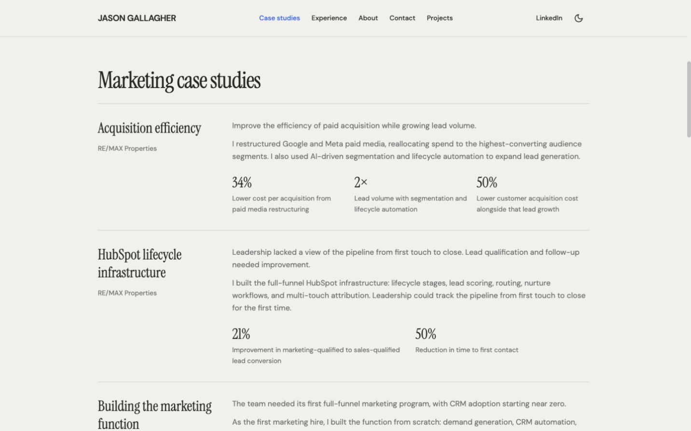
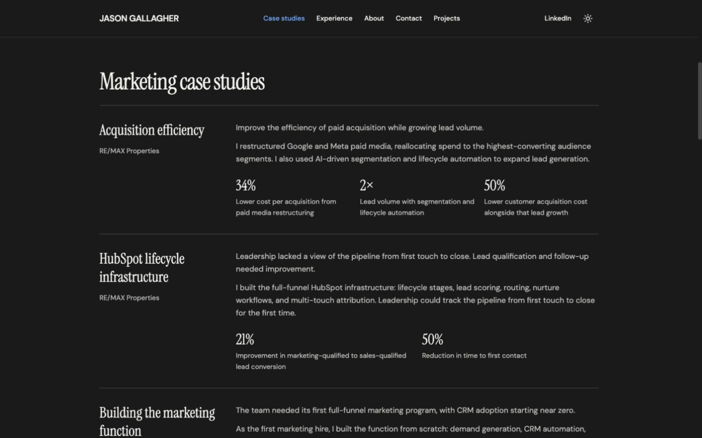
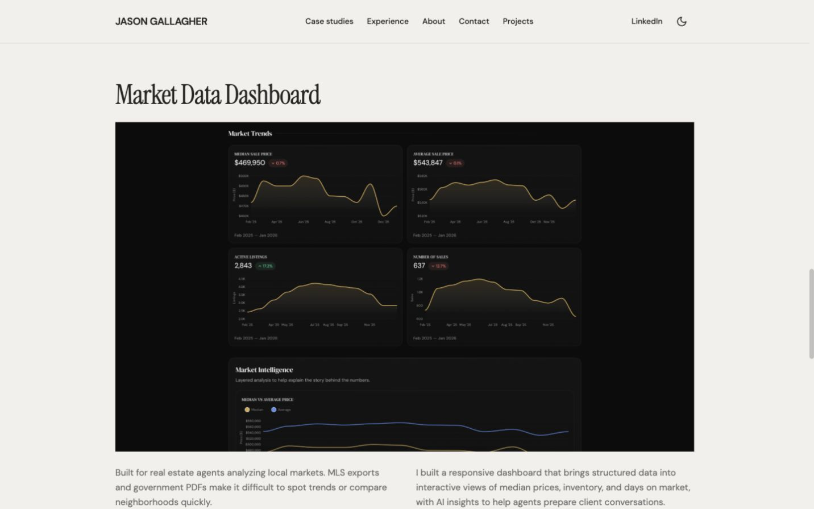
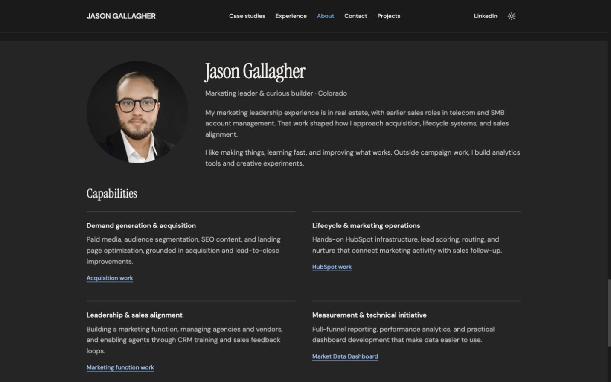
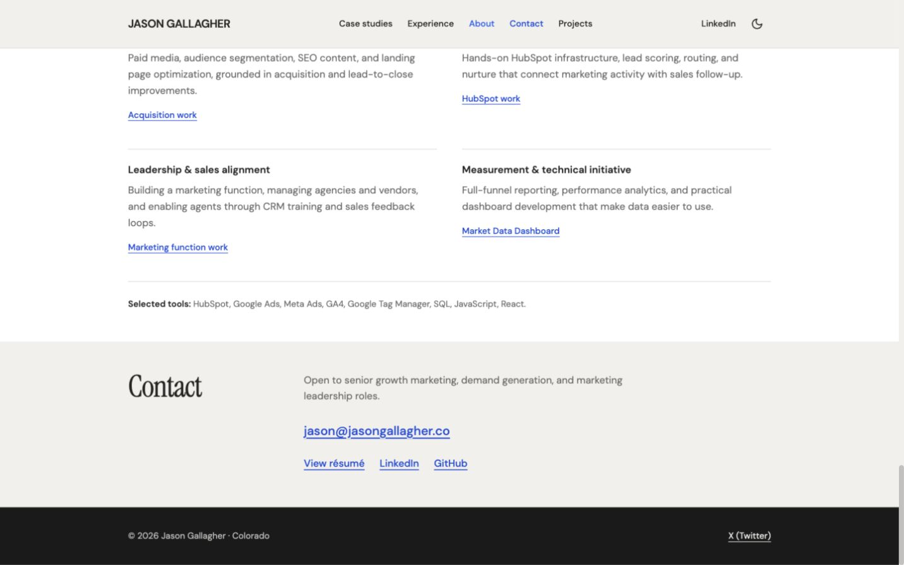
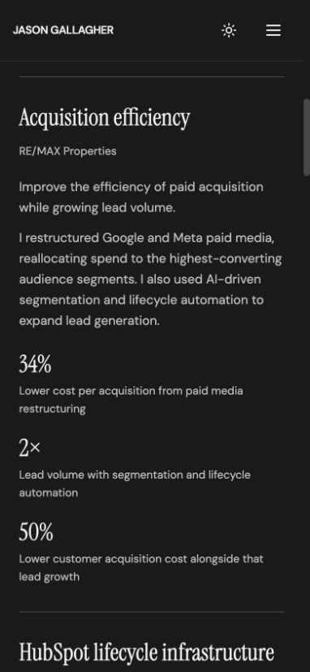
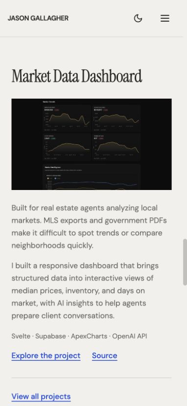
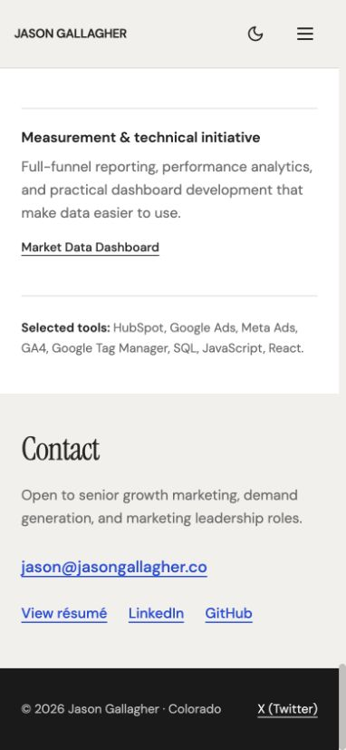

# Selected homepage refinements

Local preview, October 1, 2026: http://127.0.0.1:5174/#expertise. No commit, push, or production deployment was made.

Implemented the user's selection of original audit options **1, 4, and 5**:

- Marketing case studies now use open rows, thin separators, employer context, concise problem/contribution paragraphs, and integrated documented results. Repeated contribution/change descriptions were combined. The three case-study anchors remain available.
- Market Data Dashboard now leads with its own section heading and a full-width actual screenshot. The generic section slogan, redundant project label, outer card, image panel, and nested rounding were removed. Audience, problem, contribution, intended practical value, stack, source, and broader portfolio links remain.
- Homepage section headings are left-aligned, with italic emphasis reserved for the signature opening. Shared widths are 1024px maximum, section spacing is 40px on mobile/48px from the medium breakpoint, and headings use the existing 36px/48px scale. Case-study headings use 30px, role headings 20px, and body text remains 16px or larger.
- Removed the homepage's reveal/entrance animations, decorative button/social icons, link arrows, navbar blur and boxed LinkedIn action, portrait ring, experience gradient divider, and button hover lift. Menu/theme controls and meaningful metric-direction icons remain. Hover feedback and focus outlines remain.
- About copy is shorter. The contact section uses a prominent email link and a compact professional-link row. The footer no longer repeats a second contact directory. The X profile remains linked in the footer.
- Added an accessible name to the Projects page's existing icon-only mobile back link.

The centered opening composition, headline size, three opening results, mobile metric order, fonts, palette, theme preference/storage, established section IDs, résumé destination, and project URLs are retained. No new numerical or industry claims were introduced. Existing factual confirmation notes remain in [homepage-content.md](../../homepage-content.md).

## Validation

- `npm run build` passes after the final code change. `git diff --check` passes. The repository defines no lint or test script.
- Visual inspection at 1440×900 and 390×844 in light/dark themes. Additional checks at 320, 768, and 1024px found no horizontal overflow or text/link bounding boxes extending beyond the viewport.
- The first case-study article is approximately 672px tall at 390px, compared with approximately 990px in the preceding audit. Its smaller size comes from removing repeated prose and separate panel padding; outcomes still follow the narrative because the separate mobile reordering option was not selected.
- Homepage DOM maintains one h1, section h2 headings, case/role h3 headings, and h4 capability headings. The featured project is now an h2 rather than sitting beneath a redundant section title.
- Computed DOM text-color checks found no threshold failures among 104 rendered text elements in dark desktop mode or 93 in light mobile mode. Observed minima were 6.85:1 and 4.68:1 respectively. Checks composite foreground/background alpha and use normal/large text thresholds; these do not certify full accessibility or measure text embedded in screenshots.
- Keyboard checks: Tab reaches the mobile menu's first section link with a visible 2px outline and 4px offset; Escape closes the menu and returns focus to the toggle; selecting a section closes the menu and focuses the target. The skip link becomes visible, and Enter focuses `main-content` at the page top.
- The project image loads at its expected aspect ratio. “Explore the project” opens `/projects#market-data` with the project positioned 96px below the viewport top. “View all projects” retains all five projects, and “Back to homepage” returns to `/`.
- `/resume` opens the existing public two-page `Jason_Gallagher_Resume_26.pdf` in Google Drive. Contact links retain professional email, LinkedIn, and GitHub destinations. No contact message was sent.
- No browser console errors were observed. Homepage components contain no Framer Motion entrance/reveal declarations; the existing reduced-motion CSS remains for smooth scrolling and CSS transitions. An OS-level reduced-motion preference was not emulated in this run.

## Preview screenshots

Screenshots were captured from the local browser and inspected after saving.

### Desktop opening

### Desktop editorial case studies, light

### Desktop editorial case studies, dark

### Desktop project

### Desktop about, dark

### Desktop contact

### Mobile case study, light

### Mobile case study, dark

### Mobile project

### Mobile contact

