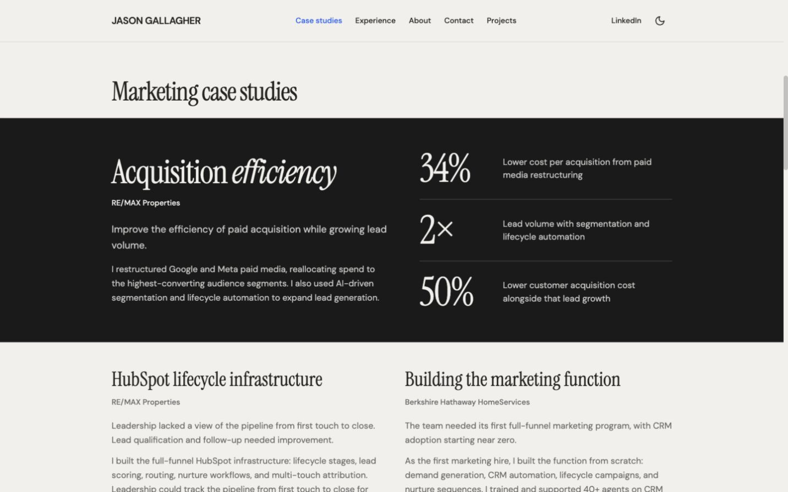
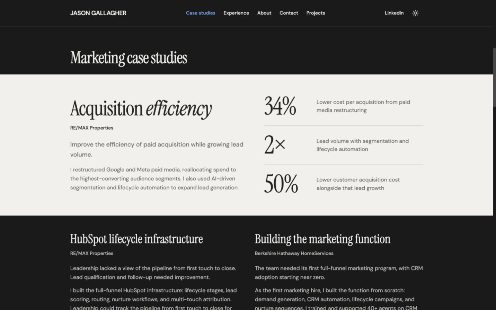
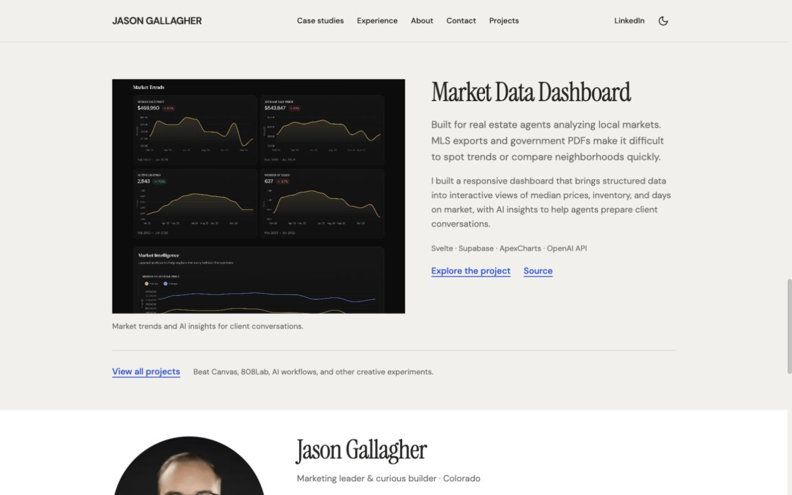
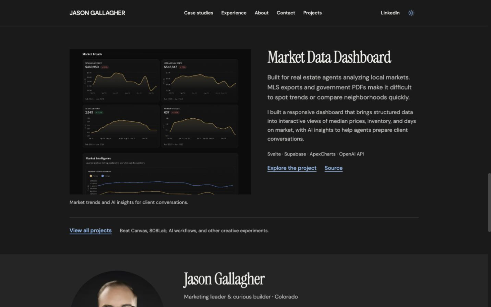
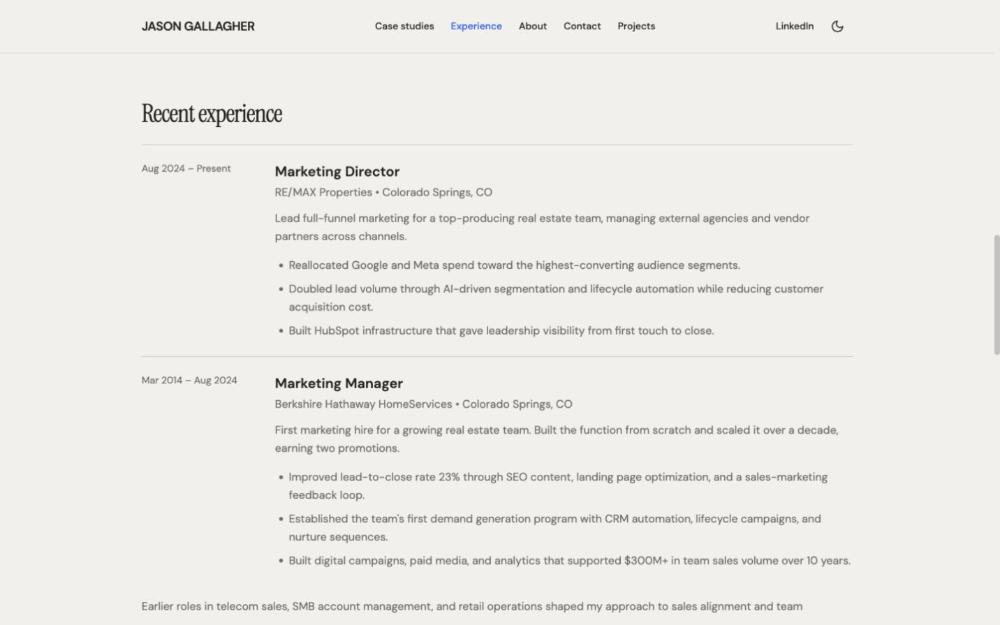
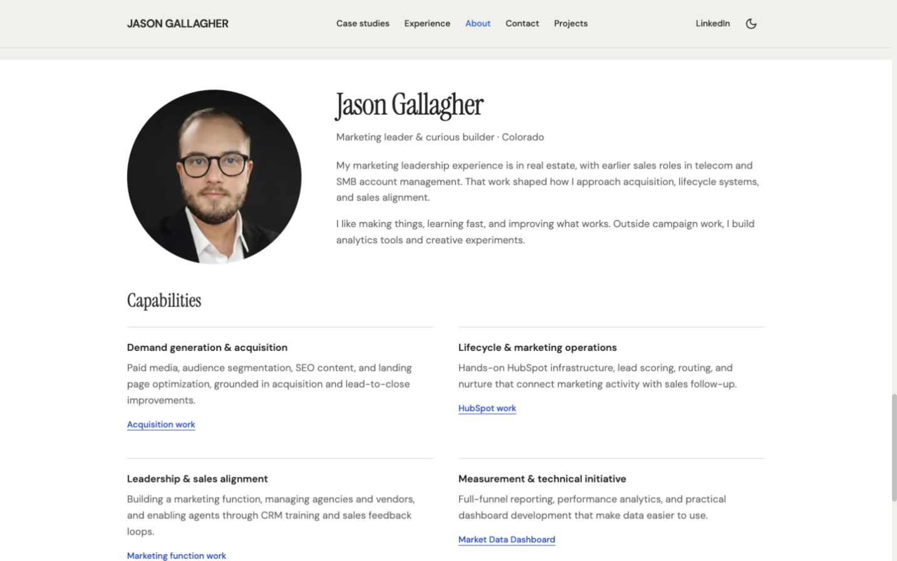
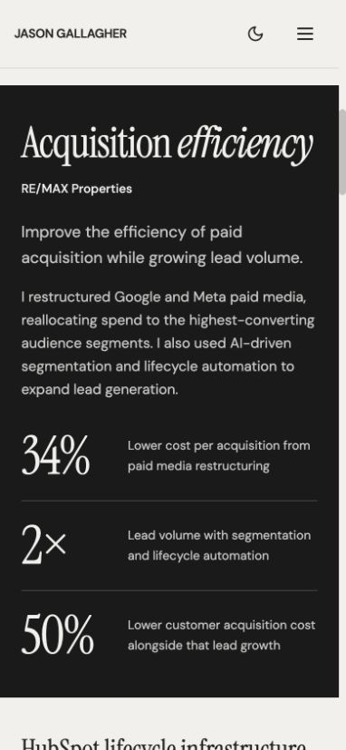
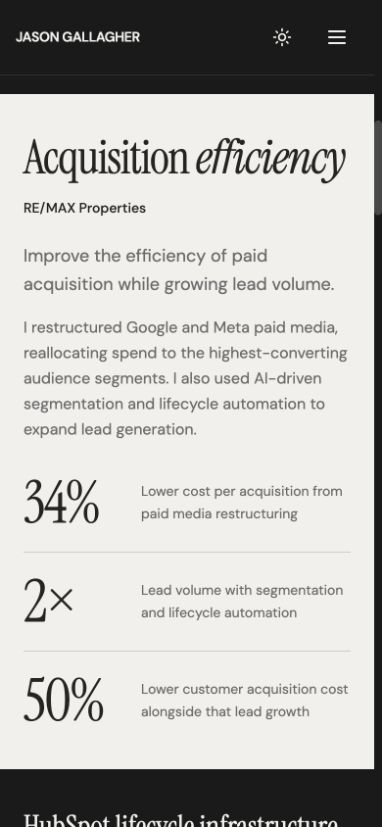
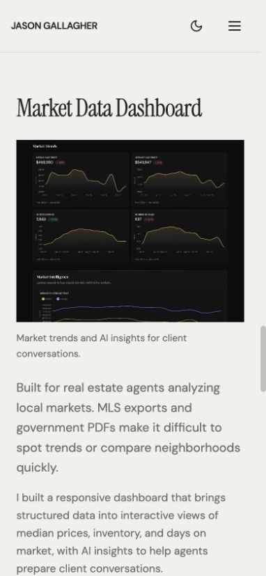
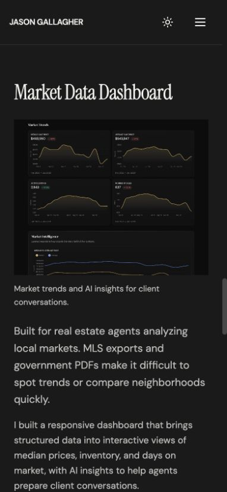

# Visual rhythm refinement

Local preview: http://127.0.0.1:5174/#expertise. Updated October 1, 2026. This report records the local review completed before publication.

## Changes

The preceding draft treated most evidence as similarly sized ruled rows. This pass restores priority and variety using the existing fonts, warm neutral palette, and blue accents.

- The acquisition case is the main visual anchor: a full-width contrasting band, larger serif heading with selective italic emphasis, and 60/72px result figures beside their qualified labels. Light mode uses the existing dark background; dark mode inverts the band to the existing warm neutral. No new colors, decorative illustration, floating UI, shadow, rounded card shell, or animation was added.
- HubSpot and function-building cases sit in two open supporting columns on desktop and follow each other on mobile. Their outcome figures use the existing blue link colors. Complete narratives, employer context, and all documented results remain.
- Recent experience is denser, with a narrower date column, wider narrative column, smaller section heading, and less row padding. Body text remains 16px.
- The dashboard has an asymmetric image/text composition. Its title and explanatory copy sit beside the screenshot on desktop; mobile reads title, image/caption, then copy. A 5:4 CSS image viewport trims empty horizontal margins from the existing screenshot without changing the asset file. A caption explains the displayed content. Image and text links still open `/projects#market-data`.
- The desktop portrait returns to 280px, giving the personal section more presence. Mobile keeps its compact 160px portrait.

Opening composition, copy, selected metrics, content order, capabilities, professional links, résumé, navigation, URLs, and theme preference/storage remain. No new employment or performance claims were introduced. Existing factual confirmation notes remain in [homepage-content.md](../../homepage-content.md).

## Verification

- `npm run build` and `git diff --check` pass after the final code edit. No lint or test script is defined.
- Inspected desktop at 1440×900 and mobile at 390×844 in both themes. Additional 320, 768, and 1024px checks found no horizontal overflow or text/link bounds extending beyond the viewport.
- The featured acquisition case is approximately 689px tall at 390px. Its three result rows fit in one viewport when opened through its anchor. Full metric scope is retained.
- Computed text contrast checks found no threshold failures in either theme; observed minima were 4.54:1 in light mode and 4.68:1 in dark mode. These checks cover rendered DOM text colors, not chart text embedded in imagery or full WCAG compliance.
- Project-link keyboard focus has a visible 2px outline with a 4px offset. Mobile Tab navigation reaches the first section link; Escape closes the menu and returns focus to the toggle. Anchor targets remain focusable.
- One h1 remains; section/case/capability heading levels are orderly, and all homepage fragment links have existing targets.
- The project image loads, and `/projects#market-data` places the intended project 96px below the viewport top. The portfolio's Back to homepage link works.
- No browser console errors were observed. No movement or reveal animation was added; existing reduced-motion CSS remains. OS-level reduced-motion emulation was not performed in this pass.
- Professional contact and résumé destinations are unchanged and retain the prior verification results.

## Screenshots

All screenshots were saved from the local browser and inspected from their saved files.

### Desktop marketing, light

### Desktop marketing, dark

### Desktop project, light

### Desktop project, dark

### Desktop experience

### Desktop about

### Mobile marketing, light

### Mobile marketing, dark

### Mobile project, light

### Mobile project, dark

